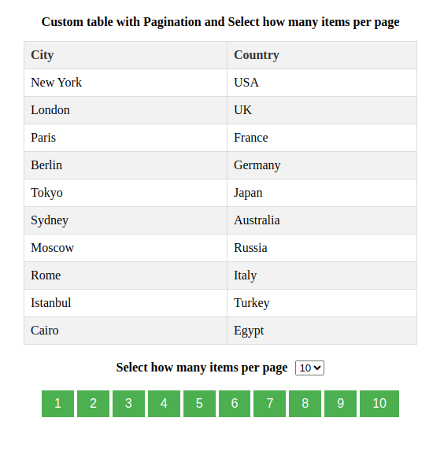

# Custom Table

> # Description 

This component is a custom table that allows users to control the number of items displayed per page and navigate through the data using pagination buttons. It's built with pure TypeScript and React, without relying on external libraries.

Available here: [Custom Table - Vítor F. Nery](https://custom-table-vitorfnery.netlify.app/)

## 🛠️ Technologies 

- React
- TypeScript
- Create React App
- Git and Github